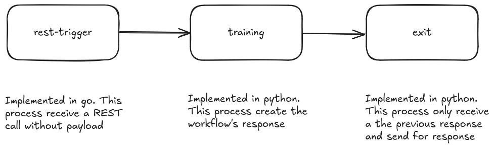

# kai-project-template

This is a template for a new project in the kai ecosystem. It includes a basic project structure.

## Usage

To use this template, click the "Use this template" button on the GitHub page. This will create a new repository with the same structure as this one.

## Structure

TBD

## Documentation index

TBD

## Setting up Local Infrastructure

This section describe the step by step process to setup the local infrastructure for testing the project.

---

### Prerequisites

Before starting, make sure to meet the following requirements:

1. **Install local KAI**:
   - Verify that all necessary components [KAI Requirements](https://github.com/konstellation-io/kai?tab=readme-ov-file#requirements) are installed. There is no specific version until now.
   - Download the latest version of KAI from the [github](https://github.com/konstellation-io/kai) repository.
   - Deploy KAI locally using `kaictl.sh` script, avoid errors for a previous version installed using flag `dracarys`.
        ```bash
        ./kaictl.sh dev --dracarys
        ```

2. **Create a User in Keycloak**:
   - Access the Keycloak admin console (`auth.kai.local`) using the administrator credentials.
   - Create a new user in the Konstellation realm and assign them to the `admin` group.
   - Remove refresh token from the user created.

3. **Install Kai-Kli**:
   - If `Go` is not installed, install it. There is no specific version until now.
   - At this moment there is no binary release, so you need to generate the `kai-kli` binary locally by download [github](https://github.com/konstellation-io/kai-kli) repository and running the following command in the repository root:
        ```bash
        make generate
        ```
   - Using the CLI generated in the previous step for create configuration for the KAI server created in the first step:
        ```bash
        kli server add local kai.local --insecure   # Add the local server without security
        kli server login                            # Login to the server with the user created in Keycloak
        ```
4. **When start product**
   - When you create a product and want to start it, you need to include information about email, name and surname in the Keycloak (`auth.kai.local`) user (`kai-project-template`) auto-generated. If not, minio will not initialize corretly.


# Demo Workflow 

In this template have been included a simple workflow for showing the basic use of KLI for process and product management.



# Deployment

This section contains the instructions to deploy the workflow processes using the provided `Makefile` commands.

## Prerequisites

1. **Kai CLI**: Install the Kai CLI tool (`kli`) on your machine.
2. **Docker**: Ensure Docker is installed and running.
3. **Make**: Ensure `make` is installed to run the Makefile commands.

---

## Deployment Steps

### 1. Login to the KAI Platform
Log in to the platform to authenticate your session:
```bash
make login
```

### 2. Create the Product
Create the product for the workflow
```bash
make create-product
```

### 3. Push Process images
Depending of what you need, use root Makefile or Makefile inside each process folder. The Makefile inside each process you can use
```bash
make -C src/demo-workflow/<type-process>/<process-folder> push-image <env> <version>
```
The env and version are optionals, you can change directly in the Makefile.
In you need to push all images, use the root Makefile that push with the defaults env and version
```bash
make push-all-process-images
```

### 4. Update Product Configuration
Manually update the .kai/<environment>/<product-name>.yaml file with the correct versions for each process and product. 
Ensure the versions match the ones used in the previous step.
```yaml
version: v0.1.4
description: kai-project-template
config: {}
workflows:
  - name: demo-workflow
    type: training
    config: {}
    processes:
      - name: trigger
        type: trigger
        image: registry.kai.local/kai-project-template_rest-trigger:v0.0.1
....
```
### 5. Push the Product Version
After updating the configuration, push the product version:
```bash
make push-product-version
```

### 6. KAI current problem with automatic user
Before starting the product for the first time, check in the Keycloak configuration whether the KAI user has their email, first name, and last name set up. If not, these fields must be completed; otherwise, the process creation will fail.

### 7. Start the Product Version
Start the specific product version
```bash
make start-product-version
```

### 8. Publish the Product Version
Start the specific product version
```bash
make publish-product-version
```

### 9. Test the workflow
Start the specific product version
```bash
make publish-product-version
```

---

## Helper Commands

- **List Workflow Processes**: Display all the process images and the state of each one.
  ```bash
  make list-processes-images
  ```

- **List Product Versions**: Show all versions of the product.
  ```bash
  make list-product-versions
  ```

---